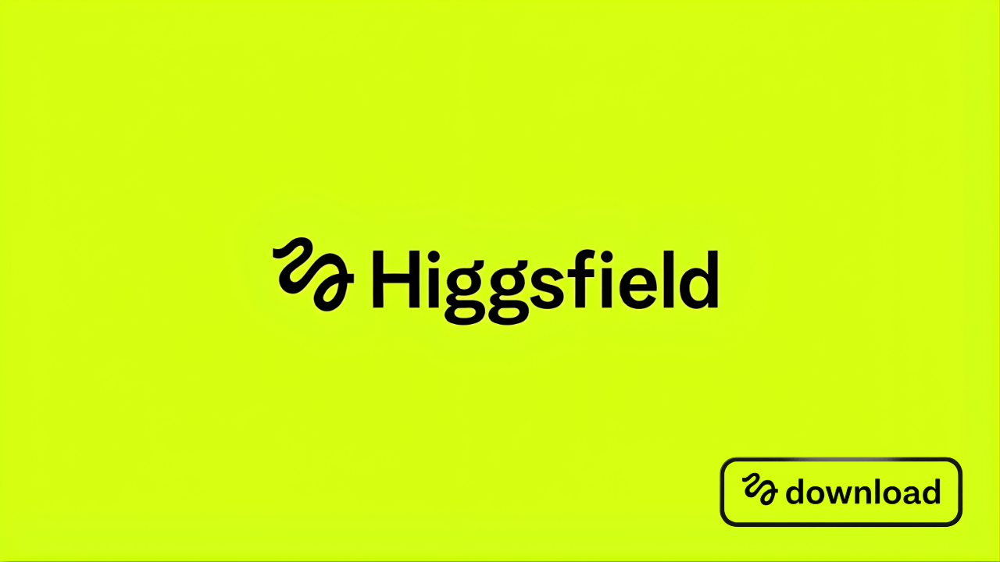

# Higgsfield Desktop — The Native App for Higgsfield AI, With a Private Local Library and a Free First Month

Higgsfield turned AI video into real directing — camera moves you pick from a menu (dolly, crash zoom, bullet-time, FPV, 360 orbit), characters that stay consistent across shots, product photos turned into polished ads. This is the **desktop client for it**: the same Higgsfield generation you know, in a native Mac/Windows app instead of a browser tab — with three things the website can't give you. **Your first month is free.** Your creations are stored **locally and privately**, not dropped into the public creator feed. And routing through the app can **stretch your credits further** by keeping previews and post-processing on your own machine.

  

> ⚡ **Early access — limited spots.** This is a launch client with a capped number of users, and access can close at any time. If you're in, you're in early.

---

## Why a desktop client at all

The Higgsfield website is excellent — but it's a website. Everything lives in your browser and on their servers: your projects sit in the cloud, your generations land in the public creator feed by default, and every preview burns credits on their infrastructure. For hobbyists that's fine. For brands working on unreleased campaigns, agencies under NDA, or anyone who just wants their work-in-progress to stay their own, the browser model has real friction.

This client keeps the Higgsfield you like and changes the parts that matter for serious use.

## What you get over the website

**🔒 A private, local library.** Every clip you generate is saved on your own machine, organized by project — and it does **not** appear in Higgsfield's public creator feed the way website generations can. Your concepts, your campaigns, your client work stay yours until you choose to share them.

**🆓 Your first month free.** Full access to Higgsfield generation through the app, free for your first month — no card up front. (Made possible through our launch arrangement with Higgsfield; see the note on access below.)

**💸 Credits that stretch further.** Heavy generation runs on Higgsfield's models — but the app keeps the lighter work local: previews, library management, and post-processing (upscaling, cleanup) happen on your own machine instead of spending credits. You burn fewer credits getting to the same final clip.

**🖥 A real native app.** Fast, always a click away, no browser tab, offline access to your whole local library, and desktop-grade project organization.

## The Higgsfield features you're coming for

All of these run through Higgsfield's official generation, wrapped in the desktop UI:

- **Camera-movement presets** — dolly, crash zoom, bullet-time, FPV, robo-arm, 360 orbit, baked into the generation like it was shot on a real rig
- **Character consistency** — lock a persona across poses, outfits, and scenes for a whole series
- **Product-to-video** — drop a product photo, get a polished ad clip, no studio or crew
- **Multi-model access** — Higgsfield's meta-platform reaches leading video models from one place; you direct camera, motion, and style per shot
- **Watermark-free HD/4K export** — MP4 optimized for YouTube, TikTok, Instagram, Reels
## How the local/cloud split actually works

Being upfront, because it matters:

**Generation happens on Higgsfield's servers.** The heavy AI models (the ones that make the video) are Higgsfield's proprietary systems, accessed through their official API. That's what you're paying for after the free month, and that's where your prompt goes when you hit generate — under Higgsfield's terms.

**Everything else stays local.** Your library, your project files, your previews, and post-processing (upscaling, cleanup) live and run on your machine. That's what keeps your work private and out of the public feed, and what stretches your credits. It's the best of both: Higgsfield's generation quality, with a private local workspace around it.

## Install

- **Windows** → `Higgsfield-Desktop-Setup.exe`, double-click. Signed.
- **Mac** → `Higgsfield-Desktop.dmg`, drag to Applications. Notarized, Apple Silicon + Intel.
Sign in with your Higgsfield account on first launch; your free month starts immediately.

## FAQ

**Is it really free?**
Your first month is free — full access to Higgsfield generation through the app, no card up front, made possible through our launch arrangement with Higgsfield. After the first month, you continue with your Higgsfield credits/subscription; the app itself stays free, and routing through it stretches those credits further by keeping previews and post-processing local. (Access is early and capped — see below.)

**What's the catch with "early access — limited spots"?**
Exactly what it says: this launch client supports a limited number of users and access can be closed at any time. It's not artificial scarcity — it's a capped rollout. Get in while it's open.

**Is this an official Higgsfield app?**
It's an independent desktop client for Higgsfield, built through an arrangement with them, using their official API for generation. The official Higgsfield product is their website; this is a native desktop way to use it with a private local library.

**Do my videos stay private?**
Your library does — every generation is stored locally and kept out of Higgsfield's public creator feed, unlike default website behavior. The generation itself still runs through Higgsfield's servers (that's where the models are), under their terms. So: private local workspace, cloud generation. We don't claim your prompts never reach Higgsfield — they have to, to generate — but your saved work stays on your machine and off the public feed.

**How does it save me credits?**
Previews, library, and post-processing (upscaling, cleanup) run on your own machine instead of Higgsfield's metered infrastructure, so you spend credits only on the actual generation, not on everything around it.

**Is it safe to install?**
Signed on Windows, notarized on Mac, SHA-256 checksums published. Download only from the Releases page here.

---

*Independent desktop client for Higgsfield AI, built through a launch arrangement with Higgsfield. Not the official Higgsfield website product. "Higgsfield," "Soul ID," "Cinema Studio," "Sora," "Kling," and "Veo" are referenced solely to identify the platform and models this client connects to (nominative fair use). Video generation runs on Higgsfield's servers via their official API under Higgsfield's terms and pricing; the free first month and capped early access are provided through this launch arrangement and may change or close at any time. Local features (library, previews, post-processing) run on your machine. MIT-licensed client — see [LICENSE](LICENSE).*

If the desktop workflow and private library made Higgsfield better for your work, a ⭐ helps other creators find it.
